# Joystick teleoperation for Robot Arms with custom [`ros_robot`](https://github.com/AdvancedResearchInnovationCenter/ros_robot/tree/py3_with_joystick) package

A ROS teleoperation node designed for controlling robot arms using a gamepad joystick. This package bridges standard joystick inputs to a custom [`ros_robot`](https://github.com/AdvancedResearchInnovationCenter/ros_robot/tree/py3_with_joystick) package

## 🚀 Features

* **Dual Control Modes:** Switch on-the-fly between continuous velocity control (Sticks) and precise 1mm/0.5° (configurable) jogging (D-Pad).
* **6-DOF Capability:** Full control over Linear (X, Y, Z) and Angular (Roll, Pitch, Yaw) axes using modifier keys.
* **Safety:**
    * **Deadman Switch:** Motion requires holding `LB`. Releases trigger an immediate stop.
    * **Heartbeat Watchdog:** Automatically stops the robot if joystick connection is lost or the driver hangs.
* **Asynchronous Jogging:** Implements non-blocking service calls for snappy D-Pad response.

---

## 📋 Prerequisites

* **ROS Noetic** (Python 3)
* `sensor_msgs` package (`joy_node`)
* **Custom Driver:** `ros_robot_pkg` branch `py3_with_joystick`

---

## 🎮 Controller Mapping (Logitech F710)

### 1. Global Controls (Active in All Modes)

| Button | Function | Description |
| :--- | :--- | :--- |
| **LB** (Hold) | **DEADMAN** | **Must be held for ANY motion.** Releasing it stops the robot immediately. |
| **Start** (Btn 7) | **MODE TOGGLE** | Switches between **Velocity Mode** and **Position Mode**. |
| **A** (Btn 0) | Cycle Frame | Switches active TCP (e.g., `TCP` $\to$ `davis` $\to$ `pressure_ft`). |
| **B** (Btn 1) | Cycle Speed | Switches speed limit presets (e.g., `Slow` $\to$ `Med` $\to$ `Fast`). |

---

### 2. Velocity Mode (Default)
*Uses Analog Sticks for smooth, continuous movement.*

| Input | Standard Action | **Shift Held (RB)** |
| :--- | :--- | :--- |
| **Left Stick Y** | **Linear X** (Forward/Back) | **Pitch** (Tilt Nose Up/Down) |
| **Left Stick X** | **Linear Y** (Slide Left/Right) | *(Unused)* |
| **Right Stick Y** | **Linear Z** (Up/Down) | *(Unused)* |
| **Right Stick X** | **Yaw** (Rotate Left/Right) | **Roll** (Tilt Side-to-Side) |

---

### 3. Position Mode (Jogging)
*Uses D-Pad for precise stepping. Active after pressing Start.*
*Default Step Size: **1.0 mm** (Linear) / **0.5°** (Angular).*

| Input | Standard Action | **Linear Shift (RB)** | **Rotation Shift (X/Btn 2)** |
| :--- | :--- | :--- | :--- |
| **D-Pad Up/Down** | **Linear X** (Fwd/Back) | **Linear Z** (Up/Down) | **Pitch** (Rot Y) |
| **D-Pad Left/Right**| **Linear Y** (Left/Right)| *(Unused)* | **Roll** (Rot X) |

> **Note:** When switching to Position Mode, the node automatically stops the UR velocity script and re-uploads the standard control script. This may take ~1-2 seconds.

---

## 🛠️ Usage

1.  **Start the Joystick Driver:**
    ```bash
    rosparam set /joy_node/dev "/dev/input/jsX" # replace X with your joystick
    rosrun joy joy_node
    ```

2.  **Start the Robot Driver:**
    ```bash
    roslaunch ros_robot bringup_robot.launch
    ```

3.  **Start the Teleop Node:**
    ```bash
    rosrun arm_teleop arm_teleop.py
    ```

---

## ⚙️ Configuration

You can modify these parameters directly in the `JoystickTeleop` class `__init__` method:

* **`speed_presets`**: Velocity scaling factors. Default: `[0.05, 0.2, 0.5]` m/s.
* **`linear_step`**: Distance per D-Pad press. Default: `0.001` m (1mm).
* **`angular_step`**: Rotation per D-Pad press. Default: `~0.008` rad (0.5 deg).
* **`frame_list`**: List of available TCP frames to cycle through.

## 📡 ROS API

### Subscribed Topics
* `/joy` (`sensor_msgs/Joy`)

### Published Topics
* `/ur_cmd_vel` (`geometry_msgs/Twist`): 50Hz heartbeat command.

### Services Called
* `/set_TCP`: Changes active TCP.
* `/change_ref_vel`: Changes max velocity scaling.
* `/move_ur_relative_async`: **(Critical)** Performs non-blocking relative moves.
* `/stop_ur`: Stops robot & kills active controller script.
* `/reupload_ur`: Re-uploads default script for position control.

## Flowchart for arm_teleop.py
